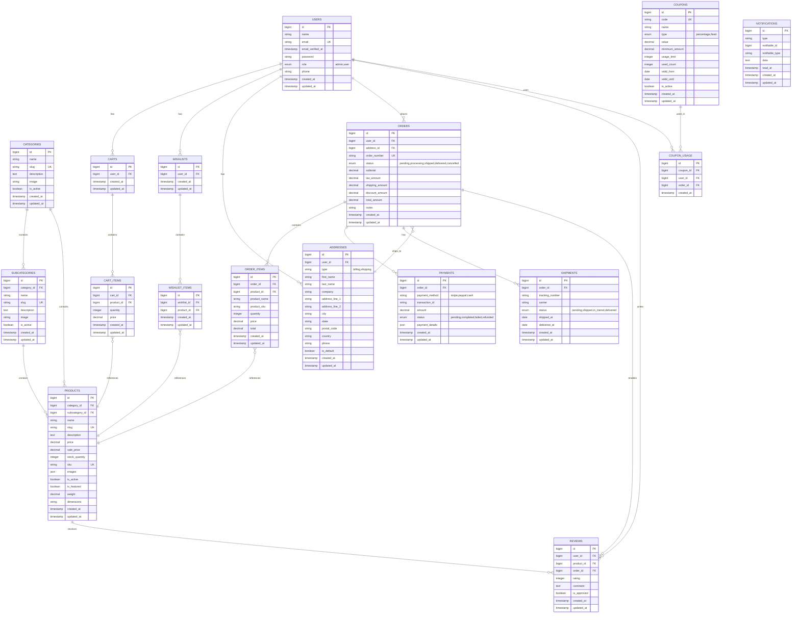

# E-commerce Database ERD

## Entity Relationship Diagram

## Key Relationships

1. **Users** can have multiple carts, wishlists, addresses, orders, and reviews
2. **Categories** contain subcategories and products
3. **Products** belong to categories and subcategories
4. **Carts** contain multiple cart items (products with quantities)
5. **Wishlists** contain multiple wishlist items (products)
6. **Orders** contain multiple order items and have one payment and shipment
7. **Addresses** are linked to users and orders
8. **Coupons** can be used multiple times by different users
9. **Reviews** are linked to users, products, and orders
10. **Notifications** are polymorphic and can be sent to any model
